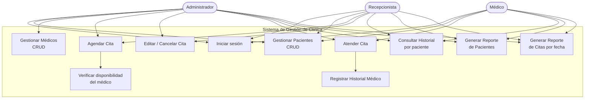
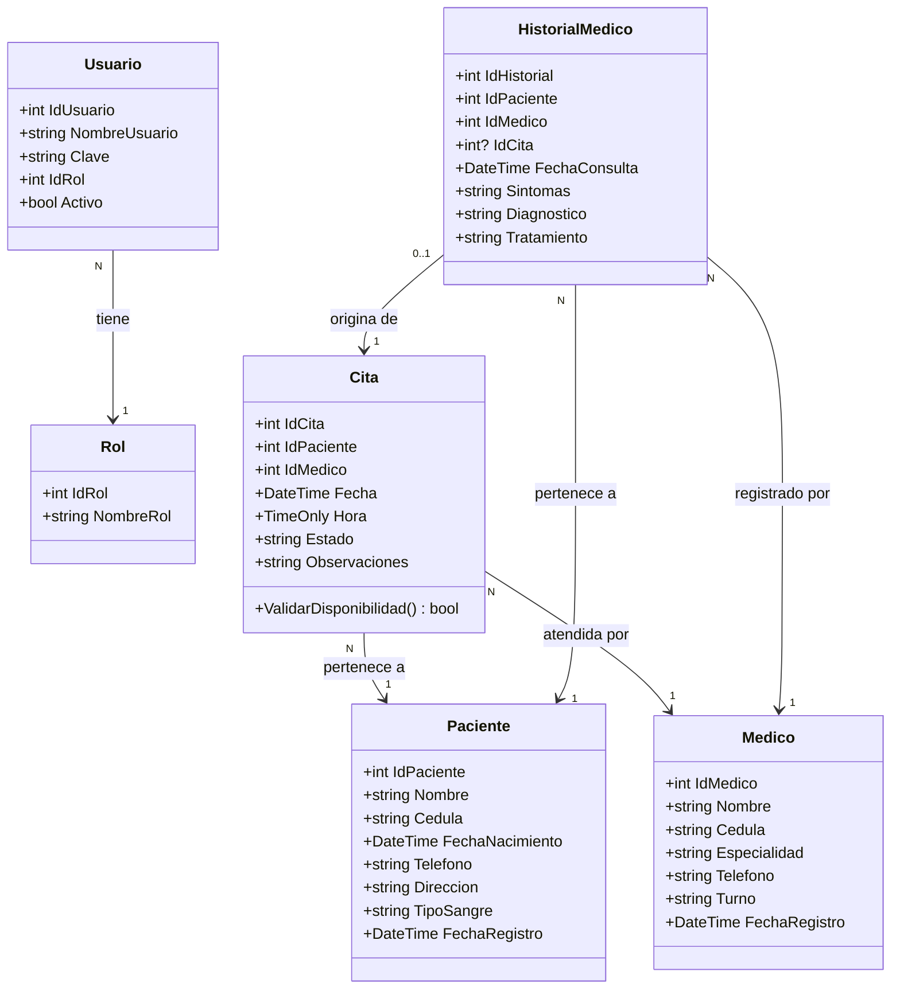

# Diagramas del Sistema — Gestión de Clínica

> Cómo generar las imágenes: pega cada bloque en https://mermaid.live (exporta PNG/SVG),
> o instala la extensión "Markdown Preview Mermaid Support" en VS Code y abre este archivo.

## 1. Diagrama de Casos de Uso

## 2. Diagrama de Clases

